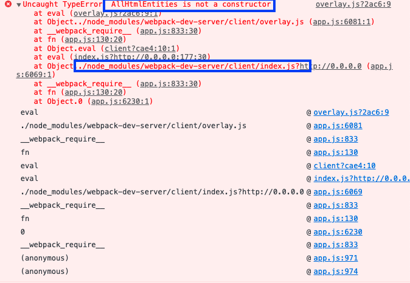
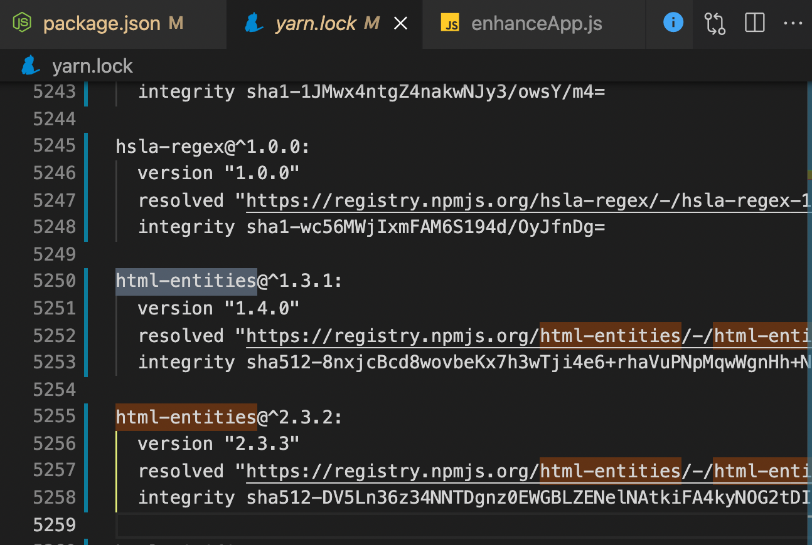
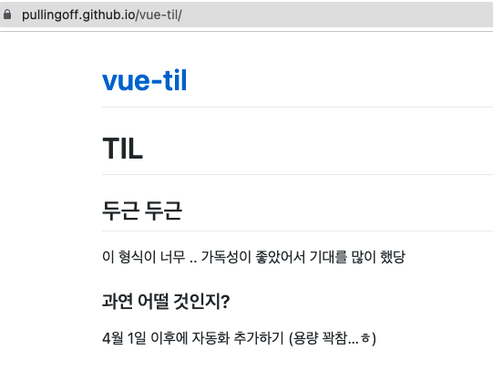
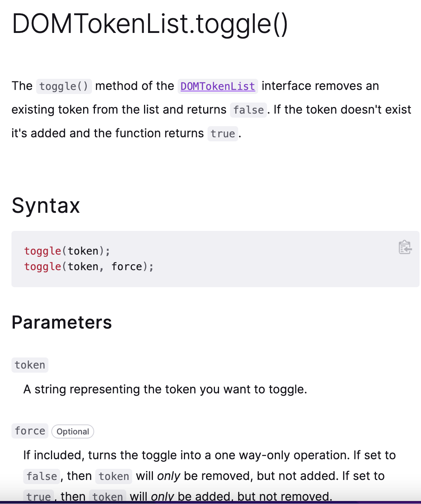

# 2022.03

## Vuepress 로컬 서버 실행시 'Uncaught TypeError: AllHtmlEntities is not a constructor' 에러 고치기



vuepress 개발할때 로컬 서버를 켜면 Uncaught TypeError: AllHtmlEntities is not a constructor가 뜰 때가 있었다.

구글링해보면 '뫄뫄 is not a constructor' 에러의 경우 import를 잘못 해줘서 발생하는 경우가 있었다. 그러나 내 프로젝트에는 AllHtmlEntities가 import되는 코드가 없었다.  

[그러다 보게된 강같은 글!](https://github.com/vuejs/vuepress/issues/2996)

vuepress repo에 이미 issue로 올라와있다. 
원인은 바로 **vuepress의 html-entity와 webpack-dev-server의 html-entity 버전이 달라서** 였다.



그래서 yarn.lock에서 html-entities를 쳐보면, 정말 두 버전이 설치되어있는걸 확인할 수 있다.

그래서 바로 터미널에서 `npm uninstall html-entities@^2.3.2`를 입력해 상위 버전을 지웠다. 대체로 `yarn remove html-entities@삭제할 버전`을 입력해도 해결될 것이다. 

에러 해결 완료! 🎉

+ vuepress를 쓸 때 버전 관련한 문제가 많았다. 이유를 찾아보니 vuepress 레포에 버그 리포트로 많이 올라와있던데, 이런 일이 자주 발생하는 것같다. 그럴 땐 대부분 에러를 package.json의 디펜던시들을 수정해줌으로서 수정할 수 있었다.

## Vuepress 깃허브에 배포하니 사이드바 안보이는 현상 고치기




vuepress로 TIL을 만드는데 로컬에서는 보이는 사이드바가 배포 후에는 안 보이는 경우가 있었다. config.js에서 디렉토리와 파일 이름으로 사이드바를 직접 만드는데, 디렉토리에 파일이 없는게 아니라, **사이드바 자체가 아예 안보여서** 뭐지싶었다. 

알고 보니 배포 전용 브랜치인 `gh-pages`를 빌드된 디렉토리(dist)랑 연결해야했는데, 실제 개발 디렉토리랑 연결해서 그런거였다. 

github pages 문서 읽어보니까 `gh-pages`를 쓰는 건 예전 방법이래서 난 docs 구조를 쓰고 있으니까 main 브랜치랑 연결하면 되는건가 했는데 아니었다.

## JS toggle로 고정된 네비게이션 햄버거 바 만들기

`position:fixed` 인 nav 바의 3단 햄버거(한자 '석 삼')를 클릭하면 블로그 카테고리 리스트가 뜨되, 스크롤 시 그 아래로 지나가지 않게 하기

### 방법

JS의 ```toggle()```을 사용하면 된다.

### Toggle



MDN 문서를 읽어보면 toggle()은 DOMTokenList(HTML Element의 classList 등)의 메소드다. 그 리스트에 파라미터(토큰)가 있는지 확인하고, 없으면 추가한 뒤 true를 리턴한다.

예를 들어 ```HTMLElement.classList.toggle('show')``` 을 하면 HTMLElement 의 클래스 목록에 'show'가 있는지를 확인하고, 있으면 true, 없으면 추가하고 true를 리턴한다.

### HTML

```html
<div id="threeBarNav" class="container" hidden onclick="clickNav(this)">
    <div class="bar1"></div>
    <div class="bar2"></div>
    <div class="bar3"></div>
</div>
```

### JS

```js
function clickNav(x) {
    x.classList.toggle("open");
    const nav = x.parentNode
    nav.classList.toggle("open")
}
```

그래서 햄버거 바를 만들때도 js onclick에 toggle()를 넣어서 `classList.toggle` 하게 하면 된다.  
그리고 open이면 그에 맞는 css를 적용해주면 끝이다!