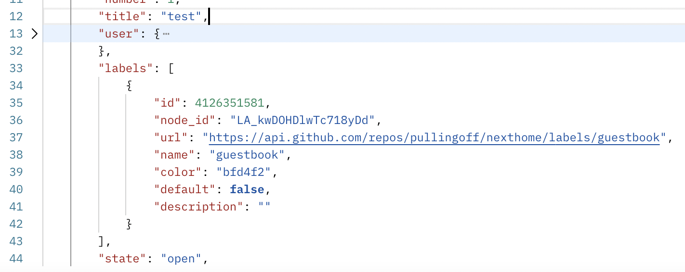

# 5월 TIL

## Next.js 방명록 남기기

개발 블로그들 돌아다니면서 'DB를 따로 쓰는 것 같진 않은데 방명록은 어떻게 구현한거지?' 궁금증이 든 적이 많았다. (예시: [찬미니즘 님 블로그](https://c17an.netlify.app/Message)) 그래서 지금 깃허브 코드를 보니까 github 저장소 `issue`에 API로 글을 쓰고, 가져오고 하는 것이었다. 

**https://api.github.com/repos/{깃허브 계정명}/{저장소 이름}/issues**

주소는 이런 식으로 해서 API `GET` 요청을 보내면 JSON 형식으로 응답이 온다.

그동안 뭐 특별한 라이브러리를 쓰는 건가!?했었는데 이렇게 간단한거였다니...!!! 새삼 깃허브가 제공하는 API 같은 걸 찾아볼 생각을 왜 안했지 싶었다. ㅎㅎ 

나도 내 블로그에 방명록 추가해야지!!!