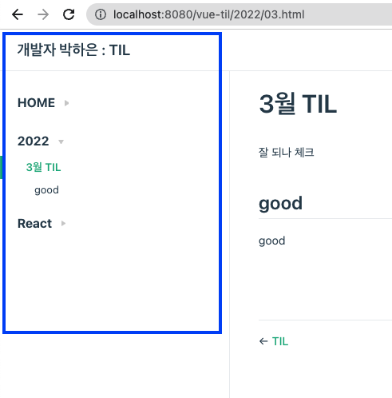

# Vuepress 깃허브에 배포하니 사이드바 안보이는 현상 고치기

vuepress로 TIL을 만드는데 로컬에서는 보이는 사이드바가 배포 후에는 안 보이는 경우가 있었다. config.js에서 디렉토리와 파일 이름으로 사이드바를 직접 만드는데, 디렉토리에 파일이 없는게 아니라, **사이드바 자체가 아예 안보여서** 뭐지싶었다.

알고 보니 배포 전용 브랜치인 `gh-pages`를 빌드된 디렉토리(dist)랑 연결해야했는데, 실제 개발 디렉토리랑 연결해서 그런거였다.

github pages 문서 읽어보니까 `gh-pages`를 쓰는 건 예전 방법이래서 난 docs 구조를 쓰고 있으니까 main 브랜치랑 연결하면 되는건가 했는데 아니었다.
