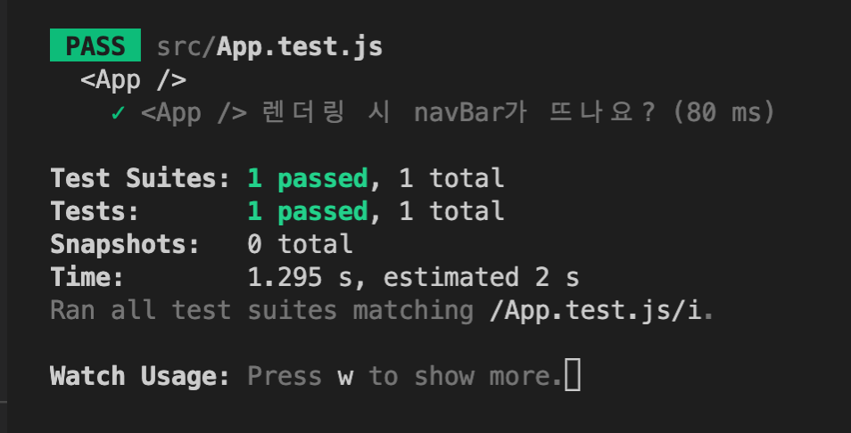

# 리액트 테스트 코드 짜는법, 리액트 테스팅 라이브러리 사용법

## 서론

다들 TDD, TDD 하는데 본 코드도 짜기 힘든데 테스트 코드를 같이 짜라고...? 하는 생각에 테스트 코드를 작성하지 않는 분들이 많을 것 같다.

나도 항상 그래왔다. 그래서 해보지도 않고 미루기보다, 사람들이 왜 그렇게 입모아 테스트의 중요성을 외치는 지 알기 위해 내가 직접 테스트 코드를 짜고 적용해봤다.

## 리액트 테스팅 라이브러리

리액트 CRA에서 제공하는 [테스팅 라이브러리](https://testing-library.com/docs/queries/about)를 써봤다.  
일단은 이 페이지만 알아도 가벼운 테스트 코드를 작성할 수 있다.

## 테스트 코드 개발 시작

중요한 점은 TDD를 하려면 테스트 코드를 먼저 짜고, 그 다음 본 코드를 적어야한다는 거다. 

1. 원하는 기능이 작동하는지 테스트하는 테스트 코드 작성 (당연히 오류가 난다)
2. 오류가 나면, 그 오류를 고칠 수 있는 본 코드를 작성
3. 테스트 구동, 오류가 여전히 나면 본 코드를 수정 (테스트 성공할때까지 반복)
4. 테스트 성공
5. 리팩토링(후에도 테스트가 성공해야함) 

## 리액트 라우터 테스트


(개발 중인 코드에 테스트 코드를 넣은거라 완전 TDD는 아님 주의)  
위 gif를 보면 App 컴포넌트 안에 리액트 라우터를 사용해 라우팅 정보를 넣어두었다.  
또 왼쪽에 네비게이션 바를 두어, 페이지를 이동할 수 있다.  
가장 먼저, **앱 실행 시 상단에 'LeadPet'이라고 적힌 네비게이션 바가 뜨는지** 확인하고 싶다.

``` js
    describe('<App />', () => {
        test('<App /> 렌더링 시 navBar가 뜨나요?', async ()=> {
            const history = createMemoryHistory()
            render(
                <Router location={history.location} navigator={history}>
                    <App />
                </Router>
            )

            await expect(screen.getByText('LeadPet')).toBeInTheDocument();
        });
    });
```

테스트 구동: `npm test App.test.js`

리액트 라우터 테스트 방법 또한 [공식 문서](https://testing-library.com/docs/example-react-router/)를 참고했다.  
라우터 정보가 없는 `App` 컴포넌트라면 그냥 `render(<App />)`로 테스트해도 되는데, 라우터 정보가 있는 앱 컴포넌트의 경우 `useRoutes() may be used only in the context of a Router component.` 에러가 뜨므로 주의!

하단의 `expect`문장을 통해 **렌더링된 screen에 LeadPet이라는 텍스트가 있는지** 확인하고, 있으면 테스트를 통과하게 된다.



그럼 이렇게 테스트 성공!