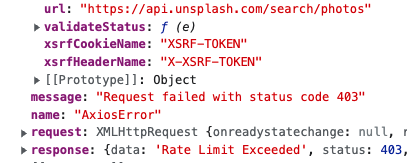

# 리액트 Unsplash API 사용법 (REST API)

## Unsplash API 사용하기

얼마전 Unsplash API를 사용해서 무한 스크롤, 검색이 가능한 [갤러리](https://pullingoff.github.io/gallery/)를 개발해보았다. 완성된 [소스코드는 이 저장소에서 확인](https://github.com/pullingoff/gallery))할 수 있다.

[Unsplash API 공식문서](unsplash.com/documentation)에 따라 가입하고 앱을 생성하면 `Access Key`를 발급받게 된다. 그 키는 보안이 중요하므로 `.env` 파일에 로컬 변수로 넣어주고, `.env`파일을 `.gitignore`에 등록해 유출되지 않도록 한다.

그 후, API 공식문서에 따라 Authorization header에 액세스키를 넣고, 요청을 보내면 된다.

```js
const headers = {
  Authorization: `Client-ID ${ACCESS_KEY}`,
};

// 생략
const { data: imgData } = await axios.get(
      'https://api.unsplash.com/search/photos',
      { headers }
    );
```

이렇게 하면 Unsplash API가 사진 목록을 정상적으로 보내준다. 공식 문서가 친절하고 알아보기 쉽게 적혀있어서 어렵지 않았음!

## 403 에러 핸들링



근데 하다보면... 403 에러가 뜬다. `response.data`를 보면 **Rate Limit Exceeded** 라고 적혀있다. API를 무료로 이용하는 Demo 버전의 경우 시간당 50회만 요청이 가능해서 제한된 횟수를 넘어서 에러를 보낸다.

그럼 이런 상황엔 어떻게 처리를 해야할까? 지금은 그냥 `console.log(error)`만 해둔 상태다.
